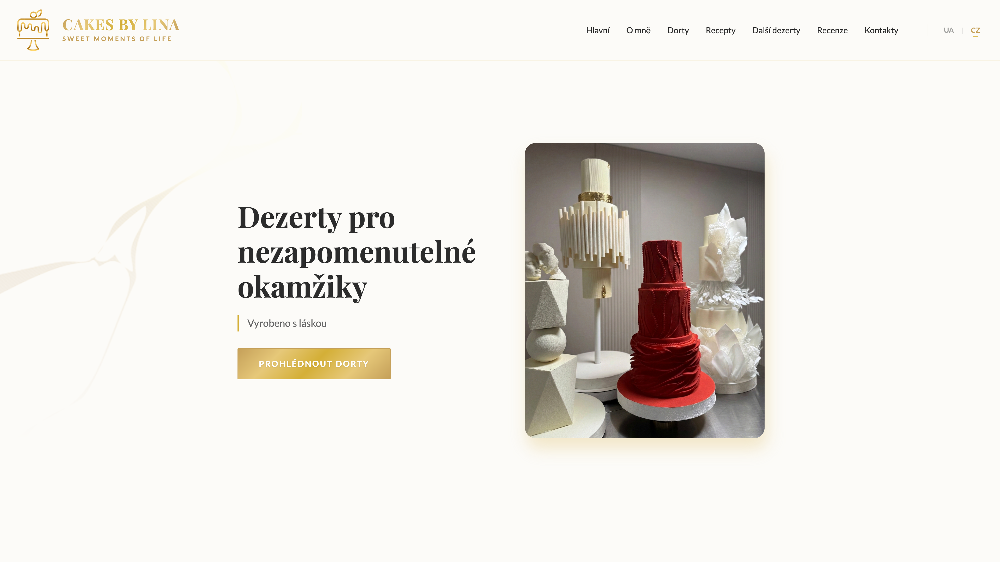
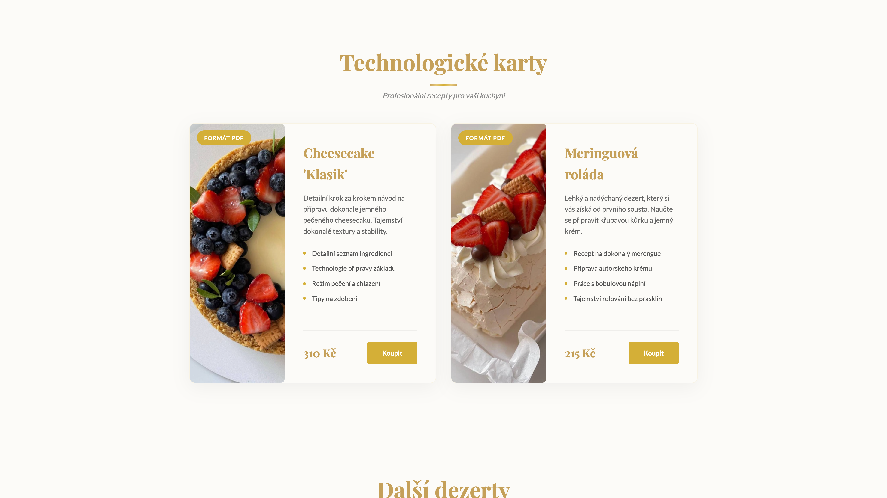

# Cakes by Lina

A landing page for **Cakes by Lina** — handcrafted desserts and custom cakes from Bruntál / Olomouc, Czech Republic.

🌐 **Live demo:** [cakes-by-lina.netlify.app](https://cakes-by-lina.netlify.app/)

---

## Preview





---

## About

Single-page portfolio site for confectioner Anhelina Babii. Includes a catalog of signature cakes, technical recipe cards, a gallery of other desserts, customer reviews, and a contact section with an embedded map. The interface is fully translated into Ukrainian 🇺🇦 and Czech 🇨🇿.

## Sections

| Section | Description |
| --- | --- |
| **Hero** | Main banner with a CTA |
| **About** | Confectioner bio and stats |
| **Cakes** | Catalog of 14 signature cakes with detail modals |
| **Recipes** | Step-by-step technical recipe cards (PDF) |
| **Other Desserts** | Gallery of additional sweets |
| **Reviews** | Customer reviews slider |
| **Contacts** | Address, phone, Instagram, Google Map |

## Stack

- **Vite 7** — build tool and dev server
- **Vanilla JavaScript** — no frameworks
- **CSS3** — custom animations, reveal effects, responsive layout
- **Google Fonts** — Playfair Display + Lato
- Custom **i18n** system (UA / CZ) via `data-i18n` attributes

## Features

- 📱 Fully responsive (mobile-first)
- 🌍 UA / CZ language switcher
- ✨ Scroll-triggered animations (reveal, zoom, parallax)
- 🍰 Interactive cake gallery with modal details
- 📍 Embedded Google Map
- 💬 Customer reviews slider

## Getting Started

```bash
# Install dependencies
npm install

# Run dev server (http://localhost:5173)
npm run dev

# Production build
npm run build

# Preview production build
npm run preview
```

## Project Structure

```
.
├── index.html              # All sections markup
├── public/
│   └── images/             # Cakes, desserts, logo assets
├── src/
│   ├── main.js             # i18n, modals, slider, animations
│   ├── style.css           # Main styles
│   └── contacts.css        # Contacts section styles
└── package.json
```

## Contacts

- 📍 Bruntál / Olomouc, Czech Republic
- 📞 [+420 776 000 575](tel:+420776000575)
- 📷 Instagram: [@cakesby.linaa](https://instagram.com/cakesby.linaa)

---

© 2026 Cakes by Lina
